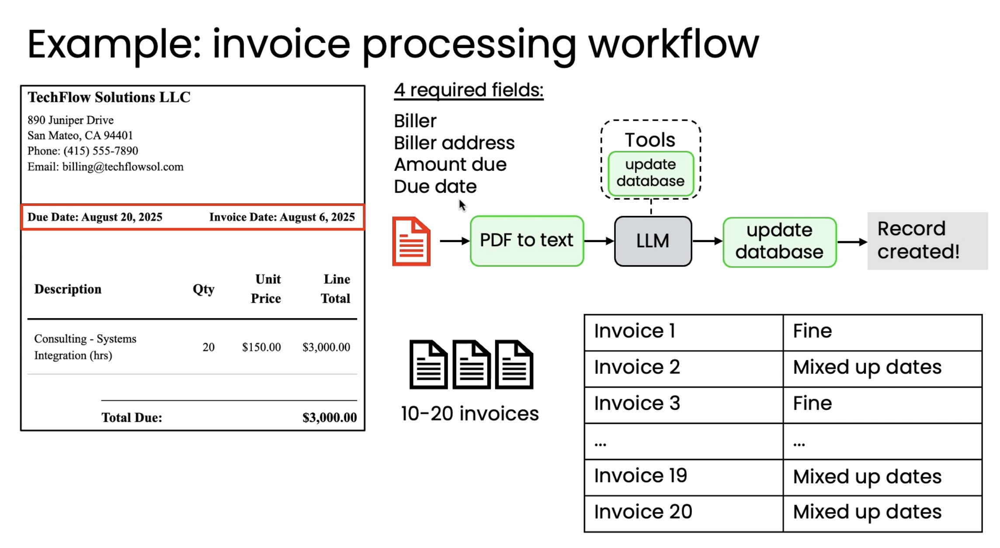
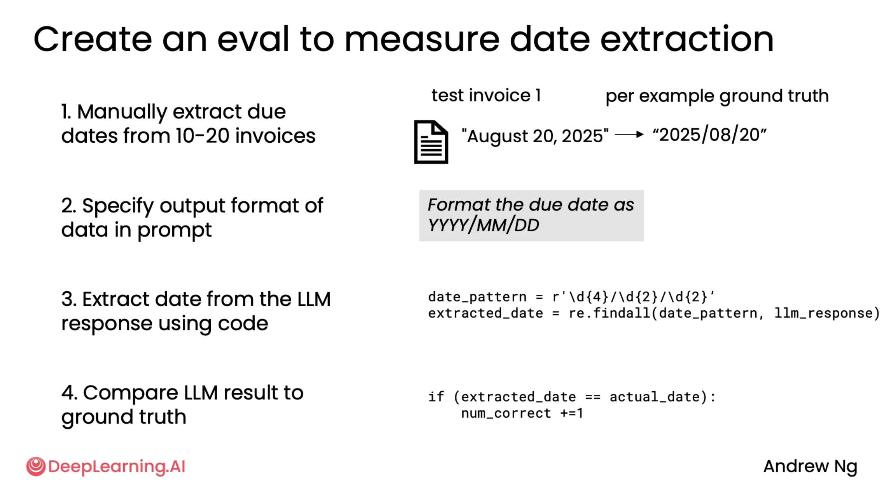
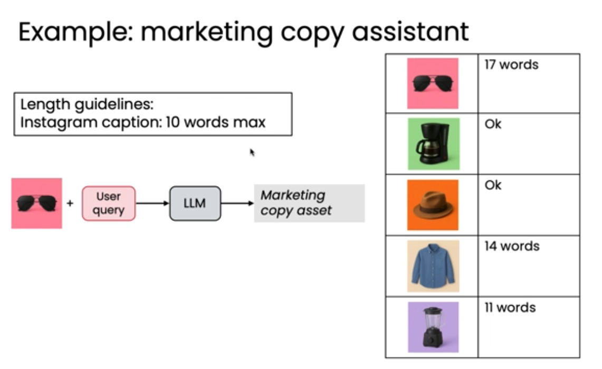
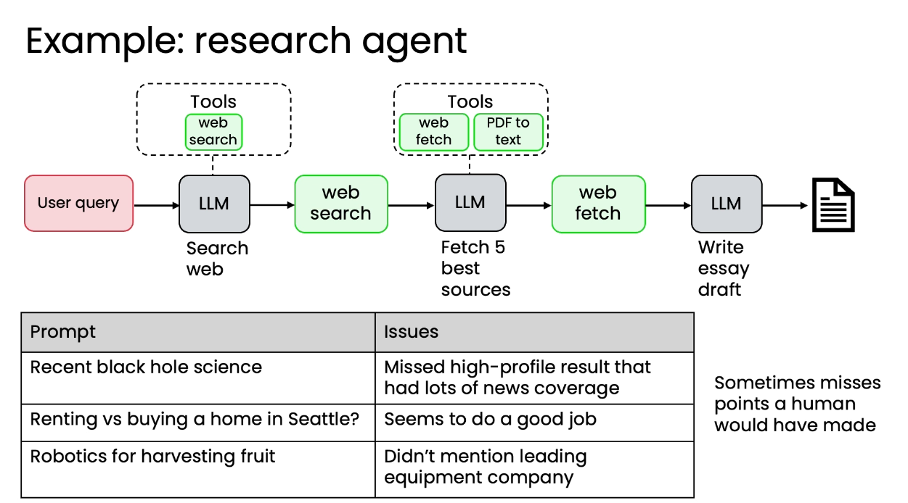
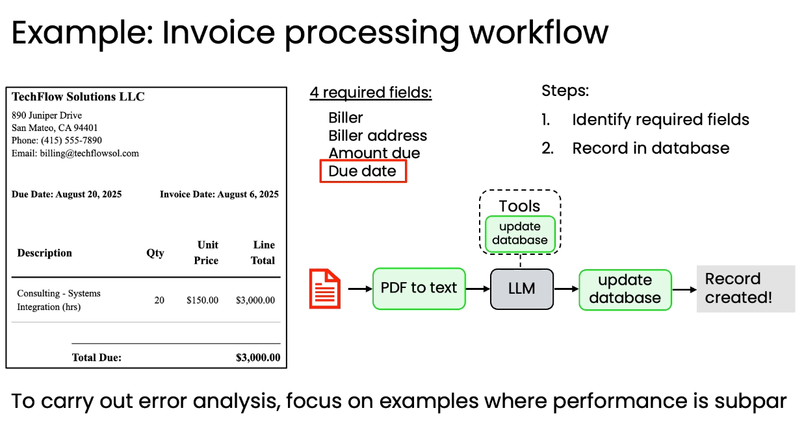
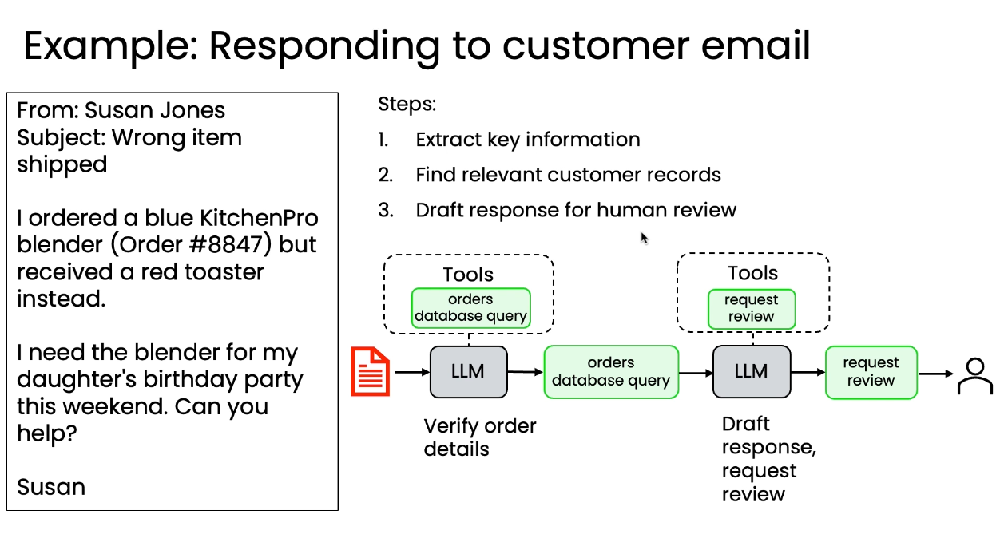
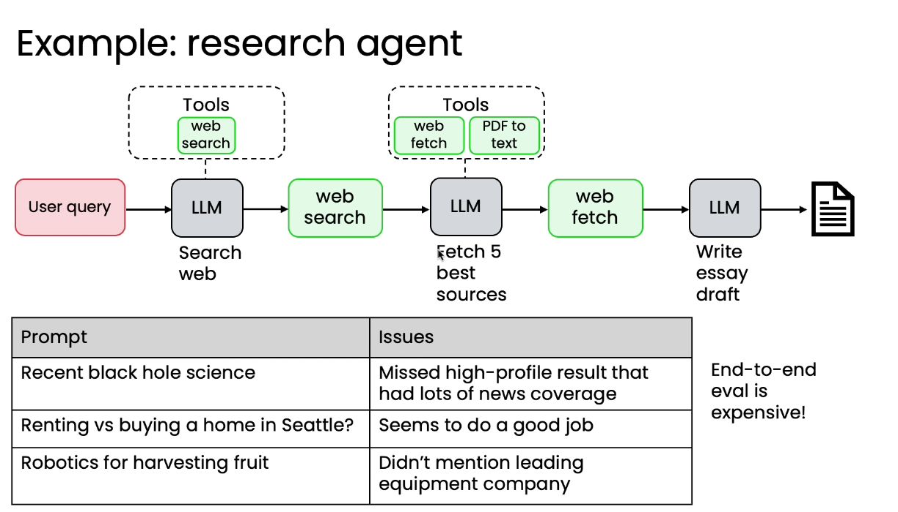

# 构建Agentic AI的实用技巧

### 一、引言：为什么需要系统化的开发流程

在构建Agentic AI系统时，许多开发者能够快速搭建出一个运行效果不错的Demo系统。然而，当系统从开发阶段走向生产环境，复杂度急剧上升时，仅凭直觉和手动观察就变得力不从心了。

这时候，你可能会面临这些问题：
- 系统效果不理想，但不知道是哪个环节出了问题
- 修改了某个组件，但不确定是否真的带来了改进
- 更换了底层LLM，系统表现变得不稳定
- 多个组件相互影响，难以定位根本原因

本文将介绍一套系统化的开发流程，帮助你构建可维护、可优化的Agentic AI系统。这套流程的核心包括：
1. **评估系统（Evals）**：建立客观的、可溯源的评估方式
2. **错误分析（Error Analysis）**：系统性地找出性能瓶颈
3. **组件级评估（Component-Level Evals）**：高效地优化单个组件
4. **问题解决**：针对性地改进识别出的问题
5. **成本与延迟优化**：在保证质量的前提下优化性能

> 这套方法论不仅适用于复杂的生产系统，即使在Demo阶段就开始应用，也能帮助你更好地理解系统，培养对Agent系统的直觉。

---

## 二、评估系统（Evals）的构建

### 2.1 为什么需要评估系统

在构建Agentflow/Workflow时，如何提升效果是个重要问题。而想提升效果，就要研究到底是哪个环节导致了效果变差——此时，就要请出我们的评估系统了。

和刀耕火种的肉眼观察法不同，构建评估测试集可以让你的Agent系统拥有客观的，可溯源的，易于扩展的评估方式。但是很显然，在项目刚启动时，从哪里开始评估似乎是个模糊的问题。

### 2.2 快速原型与迭代

此时，快速原型和迭代是关键。推荐采用快速而粗糙的迭代方法：

* 先构建一个非常简易，但功能完整的原型系统。
* 试运行并观察输出，找出表现不佳的地方。
* 利用观察结果来确定后续开发工作的优先级和方向，避免脱离实际过度空想。

> 很多开发者在项目初期会陷入"完美主义陷阱"，花费大量时间设计复杂的评估系统。实际上，从10-20个简单的测试用例开始，往往能更快地发现问题，指导后续开发。

### 2.3 评估系统的构建方法

理论总是抽象的，所以接下来我们看几个构建测试集的例子：

#### 案例一：发票处理工作流程（提取到期日）



本系统想要从发票中提取四个必填字段并保存，特别是到期日，用于及时付款。

通过手动测试并检查 10-20 张发票的输出，发现一个常见的出错点是系统混淆了发票的开具日期和到期日。



进而，我们需要改进系统以更好地提取到期日，并编写一个评估（Eval）来衡量日期提取的准确性。

具体怎么构建这个评估呢？

1. **测试集**： 找到 10-20 张发票，人工记录每个发票的正确到期日，作为正确对照。
2. **标准化格式**： 在提示词中要求 LLM 始终以固定的年-月-日格式输出到期日，便于代码自动检查。
3. **评估方式**： 编写代码（如正则表达式）提取日期，然后测试提取出的日期是否等于基本事实日期。
4. **用途**： 调整提示或其他系统组件后，用这个指标的变化来衡量准确率是否有提升。

总结一下我们的改进流程： 构建系统 → 查看输出 → 发现错误 → 针对重要错误建立小型评估 → 调整系统以提高评估指标。

#### 案例二：营销文案助理



假设你正在构建一个营销文案助理，它会根据产品描述生成营销文案。

在手动测试 10-20 个输出后，你发现了两个主要问题：
1. **语气不一致**：有时过于正式，有时过于随意
2. **缺少行动号召**：生成的文案经常忘记添加CTA（Call-to-Action）

针对这两个问题，你可以构建两个独立的评估：

**评估1：语气一致性**
- 测试集：20个产品描述及其期望的语气风格
- 评估方式：使用LLM作为评判者，评估生成文案的语气是否符合要求
- 评分标准：1-5分，5分表示完全符合

**评估2：CTA存在性**
- 测试集：同样的20个产品描述
- 评估方式：使用正则表达式或关键词检测是否包含行动号召
- 评分标准：二元评分（有/无）

> 注意这里使用了"LLM作为评判者"的方法。在很多主观性较强的任务中，使用另一个LLM来评估输出质量是一个实用的方法。当然，你需要确保评判LLM的提示词足够清晰和稳定。

#### 案例三：研究智能体



假设你正在构建一个研究智能体，它需要：
1. 理解用户的研究问题
2. 搜索相关文献
3. 综合信息并生成研究报告

在测试过程中，你发现系统在处理复杂的多步骤研究问题时表现不佳。

你可以构建一个分层的评估系统：

**端到端评估**：
- 10个完整的研究问题
- 人工评估最终报告的质量（准确性、完整性、可读性）
- 这个评估运行较慢，但能反映真实用户体验

**组件级评估**：
- 问题理解：20个问题，评估系统是否正确识别了关键概念
- 搜索质量：评估检索到的文献是否相关
- 综合能力：评估信息整合的逻辑性

> 分层评估的好处是：端到端评估告诉你"系统整体表现如何"，组件级评估告诉你"哪个环节需要改进"。这种组合能大大提高调试效率。

### 2.4 评估维度矩阵

在构建评估系统时，可以从两个维度来思考：

| 维度 | 选项 | 说明 |
|------|------|------|
| **评估范围** | 端到端 | 评估整个系统的最终输出 |
| | 组件级 | 评估单个组件或步骤的输出 |
| **评估方式** | 自动化 | 使用代码、正则、LLM评判等自动评估 |
| | 人工 | 人工检查和打分 |
| **评估指标** | 客观指标 | 准确率、召回率、F1等可量化指标 |
| | 主观指标 | 质量、可读性、用户满意度等 |

**推荐策略**：
- **早期阶段**：少量测试用例（10-20个）+ 快速人工评估
- **中期阶段**：扩展测试集（50-100个）+ 混合评估（部分自动化）
- **成熟阶段**：大规模测试集（数百个）+ 高度自动化 + 定期人工抽查

### 2.5 评估系统的最佳实践

基于实际经验，以下是构建评估系统的一些最佳实践：

**1. 从小规模开始**
- 不要一开始就追求完美的评估系统
- 10-20个精心挑选的测试用例比100个随机用例更有价值
- 随着对系统理解的加深，逐步扩展测试集

**2. 关注高频错误**
- 优先为最常见的错误类型构建评估
- 使用帕累托原则：20%的错误类型可能占据80%的问题

**3. 保持评估的可维护性**
- 评估代码应该简单、清晰、易于修改
- 记录每个测试用例的来源和目的
- 定期审查和更新测试集

**4. 平衡自动化与人工评估**

- 自动化评估适合客观、可量化的指标
- 人工评估适合主观、复杂的质量判断
- 考虑使用LLM作为评判者来半自动化主观评估

**5. 建立基准线**
- 在做任何改动前，先记录当前系统的评估分数
- 每次改动后都运行评估，对比变化
- 避免"感觉变好了"的主观判断

> 评估系统本身也需要迭代。不要期望一次就构建出完美的评估体系，而是在使用过程中不断发现问题、调整改进。

---

## 三、错误分析与优先级制定

### 3.1 为什么需要错误分析

有了评估系统后，你可能会发现系统的准确率只有70%。但这个数字本身并不能告诉你该如何改进。

错误分析（Error Analysis）就是系统性地研究那30%的失败案例，找出：
- 哪些类型的错误最常见？
- 哪些错误影响最大？
- 哪些错误最容易修复？

通过错误分析，你可以制定明确的优先级，避免盲目优化。

### 3.2 错误分析的核心方法

错误分析的基本流程：

**步骤1：收集失败案例**
- 运行评估系统，收集所有失败的测试用例
- 记录输入、期望输出、实际输出

**步骤2：分类错误类型**
- 手动检查失败案例，识别错误模式
- 为每个错误分配一个或多个类别标签
- 常见类别：格式错误、理解错误、推理错误、工具使用错误等

**步骤3：量化分析**
- 统计每种错误类型的出现频率
- 计算每种错误的影响程度（如果修复，能提升多少准确率）

**步骤4：制定优先级**
- 优先处理高频且高影响的错误
- 考虑修复难度，优先选择"性价比"高的改进

**步骤5：迭代改进**
- 针对优先级最高的错误进行改进
- 重新运行评估，验证改进效果
- 重复整个流程

> 错误分析是一个持续的过程，不是一次性的任务。每次改进后，错误分布可能会发生变化，需要重新分析。

### 3.3 实际案例分析

#### 案例一：发票处理系统的错误分析

回到我们的发票处理系统。假设在100张测试发票上，系统准确率为75%。

**错误分类结果**：
- 混淆发票日期和到期日：40%（10个案例）
- 日期格式不标准：32%（8个案例）
- 完全未找到日期：20%（5个案例）
- 其他错误：8%（2个案例）

**影响分析**：
- 如果修复"混淆日期"问题，准确率可提升至85%
- 如果修复"格式问题"，准确率可提升至83%
- 如果修复"未找到日期"，准确率可提升至80%

**优先级决策**：
1. **优先级1**：修复日期混淆问题（高频+高影响）
   - 改进提示词，明确区分发票日期和到期日
   - 添加示例，展示正确的日期识别

2. **优先级2**：标准化日期格式（中频+中影响）
   - 在提示词中明确要求输出格式
   - 添加后处理步骤，统一格式

3. **优先级3**：处理缺失日期（低频+中影响）
   - 可能需要更复杂的OCR或文档解析

#### 案例二：客户邮件回复系统

假设你构建了一个自动回复客户邮件的系统，在50封测试邮件上准确率为68%。

**错误分类**：
- 语气不当（过于正式或随意）：25%（8个案例）
- 未回答客户的核心问题：22%（7个案例）
- 提供了错误信息：19%（6个案例）
- 回复过长或过短：16%（5个案例）
- 其他：18%（6个案例）

**深入分析"未回答核心问题"**：
进一步检查这7个案例，发现：
- 4个案例：系统误解了客户意图
- 2个案例：系统理解了意图，但检索到的信息不相关
- 1个案例：系统找到了信息，但未能正确综合

**优先级决策**：
1. **优先级1**：改进意图理解（修复4个案例）
   - 添加意图分类步骤
   - 使用更强的模型或更好的提示词

2. **优先级2**：修复错误信息问题（影响严重）
   - 虽然频率不是最高，但提供错误信息的后果严重
   - 添加事实核查步骤

3. **优先级3**：优化语气（高频但影响较小）
   - 可以通过简单的提示词调整解决

> 注意这里的决策考虑了多个因素：频率、影响、修复难度。有时候低频但高影响的问题（如错误信息）应该优先处理。

### 3.4 更多错误分析示例

为了更好地理解错误分析的实践，让我们看几个更具体的例子。

#### 示例1：代码生成助手



假设你构建了一个代码生成助手，在100个测试用例上的表现如下：

**整体准确率**：72%（72个完全正确，28个有问题）

**错误分类**：
1. **语法错误**：11个案例（39%）
   - 缺少括号、分号等：6个
   - 缩进错误：3个
   - 变量名拼写错误：2个

2. **逻辑错误**：9个案例（32%）
   - 边界条件处理不当：5个
   - 算法实现错误：4个

3. **不符合需求**：5个案例（18%）
   - 误解了用户意图：3个
   - 缺少必要功能：2个

4. **其他**：3个案例（11%）

**深入分析**：
对于"语法错误"这一类，进一步分析发现：
- 大多数发生在生成较长代码（>50行）时
- Python代码的错误率明显高于JavaScript
- 使用了较弱的模型（如Claude Haiku）时错误率更高

**改进策略**：
1. **短期**：添加语法检查后处理步骤
2. **中期**：针对长代码生成优化提示词
3. **长期**：考虑为Python代码使用更强的模型

#### 示例2：文档问答系统



一个基于RAG的文档问答系统，在80个问题上的表现：

**整体准确率**：67.5%（54个正确，26个错误）

**错误分类**：
1. **检索失败**：12个案例（46%）
   - 相关文档未被检索到：8个
   - 检索到的文档不相关：4个

2. **理解错误**：8个案例（31%）
   - 误解问题意图：5个
   - 未能综合多个文档片段：3个

3. **幻觉（Hallucination）**：4个案例（15%）
   - 生成了文档中不存在的信息：4个

4. **格式问题**：2个案例（8%）

**关键发现**：
- 检索失败是最大的瓶颈
- 进一步分析8个"相关文档未被检索到"的案例：
  - 5个：问题使用了与文档不同的术语
  - 2个：问题需要多跳推理
  - 1个：文档分块不当，关键信息被切分

**改进优先级**：
1. **优先级1**：改进检索（修复术语不匹配）
   - 添加同义词扩展
   - 使用更好的embedding模型
   - 预期提升：+10%准确率

2. **优先级2**：优化文档分块策略
   - 使用语义分块而非固定长度
   - 预期提升：+1-2%准确率

3. **优先级3**：减少幻觉
   - 在提示词中强调"仅基于提供的文档回答"
   - 预期提升：+5%准确率

> 这个例子展示了如何通过错误分析发现系统的真正瓶颈。很多开发者会直接尝试改进LLM的提示词，但实际上检索质量才是关键问题。

#### 示例3：多步骤任务规划


一个任务规划Agent，需要将复杂任务分解为可执行的步骤。在50个测试任务上：

**整体成功率**：60%（30个成功，20个失败）

**错误分类**：
1. **步骤遗漏**：9个案例（45%）
   - 关键步骤被跳过：6个
   - 前置条件未考虑：3个

2. **步骤顺序错误**：6个案例（30%）
   - 依赖关系处理不当：4个
   - 并行步骤被串行化：2个

3. **步骤过于粗糙**：3个案例（15%）
   - 单个步骤包含太多子任务：3个

4. **其他**：2个案例（10%）

**模式识别**：
分析"步骤遗漏"的9个案例，发现：
- 8个案例涉及需要5步以上的复杂任务
- 6个案例中，遗漏的步骤是"非显而易见"的准备工作
- 例如：部署应用时忘记配置环境变量、数据库迁移等

**改进方案**：
1. **添加检查清单**：在提示词中提供常见的"容易遗漏的步骤"清单
2. **引入反思机制**：让Agent生成计划后，再次检查是否遗漏关键步骤
3. **使用更强的模型**：对于复杂任务，从Haiku升级到Sonnet

### 3.5 错误分析的工具与技巧

**工具推荐**：

1. **电子表格**（Excel/Google Sheets）
   - 适合：小规模分析（<100个案例）
   - 优点：灵活、直观、易于分享
   - 列设计：案例ID、输入、期望输出、实际输出、错误类型、严重程度、备注

2. **数据分析工具**（Python + Pandas）
   - 适合：中大规模分析（>100个案例）
   - 优点：可自动化、支持复杂统计
   - 可视化：使用matplotlib/seaborn绘制错误分布图

3. **专用评估平台**
   - 如：Braintrust、LangSmith、Phoenix
   - 优点：集成评估、分析、可视化
   - 适合：生产环境的持续监控

**分析技巧**：

1. **多维度分类**
   - 不要只用一个维度分类错误
   - 例如：同时记录"错误类型"和"输入特征"
   - 这样可以发现："长文本输入"+"理解错误"的组合特别常见

2. **量化严重程度**
   - 不是所有错误都同等重要
   - 使用1-5分评估每个错误的严重程度
   - 优先修复"高频+高严重度"的错误

3. **追踪改进效果**
   - 每次改进后，重新运行错误分析
   - 对比改进前后的错误分布
   - 验证改进是否真的解决了目标问题

4. **寻找根本原因**
   - 不要停留在表面现象
   - 问"为什么"5次，找到根本原因
   - 例如："日期格式错误" → "为什么？" → "提示词不够明确" → "为什么？" → "缺少具体示例"

> 错误分析是一门艺术，也是一门科学。需要既有系统性的方法，也要有对系统的深入理解和直觉。随着经验积累，你会越来越擅长快速识别问题模式。

---

## 四、组件级评估

### 4.1 端到端评估 vs 组件级评估

在前面的章节中，我们主要讨论的是端到端（End-to-End）评估，即评估整个系统的最终输出。但对于复杂的Agentic系统，端到端评估有其局限性：

**端到端评估的局限**：

- **调试困难**：当准确率下降时，难以定位是哪个组件出了问题
- **效率低下**：每次测试都要运行整个流程，耗时且成本高
- **反馈滞后**：改进某个组件后，需要运行完整流程才能看到效果

**组件级评估的优势**：
- **精准定位**：直接评估单个组件的性能
- **快速迭代**：只需运行相关组件，节省时间和成本
- **独立优化**：可以并行优化不同组件



### 4.2 组件级评估的构建方法

以一个客户支持Agent为例，系统包含以下组件：

```
用户问题 → [意图分类] → [信息检索] → [答案生成] → [质量检查] → 最终回复
```

**步骤1：识别关键组件**

首先，明确系统中的各个组件及其职责：
- **意图分类**：识别用户问题的类型（技术支持、账单、退款等）
- **信息检索**：从知识库中检索相关信息
- **答案生成**：基于检索结果生成回复
- **质量检查**：验证回复的准确性和适当性

**步骤2：为每个组件构建评估**

**组件1：意图分类**
- 测试集：100个标注好类别的用户问题
- 评估指标：分类准确率、混淆矩阵
- 运行成本：低（只需调用一次LLM）
- 目标：>95%准确率

**组件2：信息检索**
- 测试集：50个问题及其相关文档ID
- 评估指标：
  - Recall@K：前K个结果中包含相关文档的比例
  - MRR（Mean Reciprocal Rank）：相关文档的平均排名
- 运行成本：低（只需embedding和检索）
- 目标：Recall@5 > 90%

**组件3：答案生成**
- 测试集：30个问题+正确的检索结果
- 评估指标：
  - 准确性：答案是否正确（人工或LLM评判）
  - 完整性：是否回答了所有子问题
  - 简洁性：是否过于冗长
- 运行成本：中（需要调用较强的LLM）
- 目标：准确性 > 90%

**组件4：质量检查**
- 测试集：50个回复（25个好的，25个有问题的）
- 评估指标：
  - 准确率：正确识别问题回复的比例
  - 召回率：找出所有问题回复的比例
- 运行成本：低
- 目标：F1 > 85%

**步骤3：建立组件间的依赖关系**

有些组件的评估需要依赖其他组件的输出：
- 答案生成依赖信息检索的结果
- 质量检查依赖答案生成的输出

因此，评估顺序应该是：
1. 先评估独立组件（意图分类、信息检索）
2. 再评估依赖组件（答案生成、质量检查）
3. 最后进行端到端评估

### 4.3 评估流程与顺序


**推荐的评估流程**：

**阶段1：组件级评估（快速迭代）**
- 频率：每次修改组件后
- 目的：验证单个组件的改进
- 成本：低
- 示例：修改了检索算法后，只运行检索评估

**阶段2：集成评估（验证协同）**
- 频率：多个组件改进后
- 目的：验证组件间的协同效果
- 成本：中
- 示例：改进了检索和生成后，评估两者的组合效果

**阶段3：端到端评估（全面验证）**
- 频率：准备发布前
- 目的：验证整体用户体验
- 成本：高
- 示例：在完整的测试集上运行整个系统

**实践建议**：

1. **80/20原则**
   - 80%的时间用于组件级评估和优化
   - 20%的时间用于端到端评估
   - 这样可以最大化迭代速度

2. **建立评估金字塔**
   ```
   端到端评估（少量，慢，昂贵）
          ↑
   集成评估（中等数量，中速，中等成本）
          ↑
   组件级评估（大量，快，便宜）
   ```

3. **使用缓存和模拟**
   - 缓存中间结果，避免重复计算
   - 使用模拟数据快速测试下游组件
   - 例如：用固定的检索结果测试答案生成

### 4.4 组件级评估的实际案例

#### 案例：优化RAG系统的检索组件

**背景**：一个文档问答系统，端到端准确率为65%，需要提升。

**步骤1：构建组件级评估**

为检索组件构建评估：
- 测试集：100个问题，每个标注了相关文档ID
- 指标：Recall@5（前5个结果中包含相关文档的比例）
- 基准：当前Recall@5 = 72%

**步骤2：快速迭代优化**

尝试不同的优化方案：
1. **方案A**：更换embedding模型
   - 从text-embedding-ada-002 → text-embedding-3-large
   - 结果：Recall@5 = 78% (+6%)
   - 成本：embedding成本增加2倍

2. **方案B**：添加查询扩展
   - 使用LLM生成问题的同义表达
   - 结果：Recall@5 = 81% (+9%)
   - 成本：每次查询增加一次LLM调用

3. **方案C**：混合检索（BM25 + 向量）
   - 结合关键词和语义检索
   - 结果：Recall@5 = 85% (+13%)
   - 成本：几乎不增加

**步骤3：验证端到端效果**

选择方案C后，重新运行端到端评估：
- 端到端准确率：65% → 74% (+9%)
- 验证了检索改进确实带来了整体提升

**关键洞察**：
- 通过组件级评估，快速测试了3个方案
- 如果直接做端到端评估，每个方案需要10倍的时间
- 组件级评估让我们能够在1天内完成原本需要1周的工作

> 组件级评估的核心价值在于"快速反馈循环"。你可以在几分钟内验证一个想法，而不是等待几小时的端到端测试。

---

## 五、问题解决与系统优化

### 5.1 非LLM组件的优化

在Agentic AI系统中，并非所有问题都需要通过改进LLM来解决。很多时候，优化非LLM组件能带来更显著的效果提升。

#### 5.1.1 检索系统优化

**常见问题与解决方案**：

1. **问题：检索结果不相关**
   - **原因分析**：查询和文档的表达方式不匹配
   - **解决方案**：
     - 查询重写：使用LLM将用户问题改写为更适合检索的形式
     - 查询扩展：生成同义词、相关术语
     - 混合检索：结合BM25（关键词）和向量检索（语义）

2. **问题：重要信息被分割**
   - **原因分析**：固定长度分块导致语义完整性被破坏
   - **解决方案**：
     - 语义分块：按段落、章节等语义单元分块
     - 重叠分块：相邻块之间保留重叠部分
     - 父文档检索：检索小块，返回大块

3. **问题：缺少上下文**
   - **原因分析**：检索到的片段缺乏必要的背景信息
   - **解决方案**：
     - 扩展上下文：返回检索块的前后文
     - 添加元数据：包含文档标题、章节信息等
     - 层级检索：先检索章节，再检索段落

#### 5.1.2 工具调用优化

**常见问题与解决方案**：

1. **问题：工具选择错误**
   - **原因分析**：工具描述不够清晰，或工具太多导致混淆
   - **解决方案**：
     - 改进工具描述：使用清晰、具体的描述和示例
     - 减少工具数量：合并相似工具，移除不常用工具
     - 分层工具选择：先选择工具类别，再选择具体工具

2. **问题：参数填充错误**
   - **原因分析**：参数要求不明确，或需要复杂的推理
   - **解决方案**：
     - 明确参数格式：在工具描述中提供格式示例
     - 参数验证：添加参数校验和错误提示
     - 参数提取辅助：使用专门的提示词帮助提取参数

3. **问题：工具调用失败**
   - **原因分析**：工具本身不稳定，或错误处理不当
   - **解决方案**：
     - 添加重试机制：自动重试失败的调用
     - 优雅降级：提供备选方案
     - 详细错误信息：返回可操作的错误提示

#### 5.1.3 输出格式化优化

**常见问题与解决方案**：

1. **问题：输出格式不一致**
   - **解决方案**：
     - 使用结构化输出（JSON Schema）
     - 添加格式验证和自动修正
     - 提供明确的格式示例

2. **问题：输出过长或过短**
   - **解决方案**：
     - 在提示词中明确长度要求
     - 使用token限制
     - 添加后处理截断或扩展

### 5.2 LLM组件的优化

当非LLM组件已经优化到位，但系统表现仍不理想时，就需要优化LLM组件了。

#### 5.2.1 提示词工程

**优化策略**：

1. **明确任务定义**
   ```
   不好的提示词：
   "回答用户的问题"
   
   好的提示词：
   "你是一个客户支持助手。基于提供的文档，用简洁、友好的语气回答用户问题。
   如果文档中没有相关信息，明确告知用户，不要编造答案。"
   ```

2. **提供示例（Few-shot Learning）**
   - 包含2-5个高质量示例
   - 示例应覆盖不同的情况
   - 示例的格式要与期望输出一致

3. **分步推理（Chain-of-Thought）**
   ```
   "在回答之前，先：
   1. 理解用户问题的核心意图
   2. 识别需要哪些信息来回答
   3. 从提供的文档中提取相关信息
   4. 组织答案，确保逻辑清晰
   然后再给出最终回答。"
   ```

4. **约束和规则**
   - 明确什么可以做，什么不能做
   - 使用具体的规则而非模糊的指导
   - 例如："回答长度控制在100-200字"而非"简洁回答"

#### 5.2.2 模型选择

**选择原则**：

| 任务类型 | 推荐模型 | 理由 |
|---------|---------|------|
| 简单分类、提取 | Haiku | 快速、便宜、准确率足够 |
| 复杂推理、创作 | Sonnet | 平衡性能和成本 |
| 高难度任务 | Opus | 最强能力，适合关键环节 |
| 大量并发调用 | Haiku | 成本和延迟最优 |

**混合使用策略**：
- 意图分类：Haiku
- 信息检索：不需要LLM（使用向量检索）
- 答案生成：Sonnet
- 质量检查：Haiku

> 不要一开始就使用最强的模型。从较弱的模型开始，只在必要时升级。这样可以更好地理解任务的真实难度。

#### 5.2.3 上下文优化

**策略**：

1. **精简上下文**
   - 只包含相关信息，移除无关内容
   - 使用摘要代替完整文档
   - 优先级排序：最相关的信息放在前面

2. **结构化上下文**
   ```
   不好的格式：
   "这是文档1的内容...这是文档2的内容..."
   
   好的格式：
   "相关文档：
   
   [文档1 - 产品规格]
   内容...
   
   [文档2 - 使用指南]
   内容..."
   ```

3. **动态上下文**
   - 根据任务类型调整上下文内容
   - 使用对话历史时，只保留最近N轮
   - 对长对话进行摘要

### 5.3 模型选择的直觉培养

如何判断应该使用哪个模型？这需要经验和直觉。以下是一些指导原则：

**从Haiku开始的信号**：
- 任务有明确的规则和模式
- 有足够的示例可以学习
- 输出格式固定
- 不需要复杂推理

**需要Sonnet的信号**：
- 需要理解复杂的上下文
- 需要多步推理
- 输出需要创造性
- Haiku的准确率不够

**需要Opus的信号**：
- 任务极其复杂
- 错误代价很高
- Sonnet也无法达到要求
- 预算允许

**实践建议**：
1. 总是从Haiku开始测试
2. 如果准确率<80%，尝试Sonnet
3. 如果Sonnet准确率<90%，考虑Opus或优化其他组件
4. 定期重新评估：模型在不断进步，之前需要Opus的任务可能现在Sonnet就够了

---

## 六、延迟与成本优化

### 6.1 优化的时机

**重要原则**：不要过早优化！

在以下情况下才考虑优化延迟和成本：
1. **系统准确率已经达标**：先保证质量，再优化效率
2. **有明确的性能瓶颈**：通过监控发现了具体问题
3. **用户反馈延迟问题**：实际影响了用户体验
4. **成本超出预算**：运营成本不可持续

> 很多开发者在系统准确率只有60%时就开始优化延迟，这是本末倒置。一个快速但不准确的系统毫无价值。

### 6.2 延迟优化方法

#### 6.2.1 并行化

**策略**：识别可以并行执行的操作

**示例**：
```python
# 串行执行（慢）
intent = classify_intent(query)
docs = retrieve_documents(query)
answer = generate_answer(query, docs)

# 并行执行（快）
intent_task = async_classify_intent(query)
docs_task = async_retrieve_documents(query)
intent, docs = await asyncio.gather(intent_task, docs_task)
answer = generate_answer(query, docs)
```

**适用场景**：
- 多个独立的LLM调用
- LLM调用和数据库查询
- 多个工具调用

**注意事项**：
- 确保操作真的独立
- 考虑资源限制（并发数）
- 处理部分失败的情况

#### 6.2.2 缓存

**策略**：缓存重复的计算结果

**缓存层级**：

1. **Embedding缓存**
   - 缓存常见查询的embedding
   - 节省embedding计算时间
   - 适合：FAQ系统、重复查询多的场景

2. **检索结果缓存**
   - 缓存查询→文档的映射
   - 节省检索时间
   - 适合：文档更新不频繁的场景

3. **LLM响应缓存**
   - 缓存完全相同的输入→输出
   - 节省LLM调用
   - 适合：确定性任务（分类、提取）

**实现示例**：
```python
import hashlib
from functools import lru_cache

@lru_cache(maxsize=1000)
def cached_embedding(text):
    return compute_embedding(text)

# 或使用Redis等外部缓存
def get_or_compute(key, compute_fn):
    cached = redis.get(key)
    if cached:
        return cached
    result = compute_fn()
    redis.set(key, result, ex=3600)  # 1小时过期
    return result
```

#### 6.2.3 流式输出

**策略**：边生成边返回，而不是等待完整响应

**优势**：
- 用户感知延迟大幅降低
- 可以提前取消不需要的生成
- 更好的用户体验

**实现**：
```python
# 非流式（用户等待5秒）
response = llm.generate(prompt)
return response

# 流式（用户立即看到输出）
for chunk in llm.generate_stream(prompt):
    yield chunk
```

**适用场景**：
- 长文本生成
- 对话系统
- 实时反馈重要的场景

#### 6.2.4 模型降级

**策略**：对不重要的任务使用更快的模型

**示例**：
- 意图分类：Opus → Haiku（延迟降低5倍）
- 摘要生成：Sonnet → Haiku（质量略降，速度提升3倍）
- 质量检查：Sonnet → 规则引擎（延迟降低10倍）

**决策框架**：
1. 评估任务的重要性
2. 测试较弱模型的准确率
3. 如果准确率下降<5%，考虑降级
4. 监控降级后的实际效果

#### 6.2.5 预计算

**策略**：提前计算可预测的结果

**示例**：
- 预先生成常见问题的答案
- 预先计算文档的embedding
- 预先生成摘要和元数据

**适用场景**：
- 文档集合相对固定
- 有明确的高频查询
- 可以接受一定的数据新鲜度延迟

### 6.3 成本优化方法

#### 6.3.1 模型选择优化

**成本对比**（相对值）：
- Haiku：1x
- Sonnet：15x
- Opus：75x

**优化策略**：
1. **审计当前使用**
   - 统计每个组件的模型使用情况
   - 计算各部分的成本占比
   - 识别成本最高的环节

2. **降级非关键组件**
   - 将Opus降级为Sonnet：成本降低5倍
   - 将Sonnet降级为Haiku：成本降低15倍
   - 前提：准确率下降可接受

3. **混合策略**
   ```
   示例：客户支持系统
   - 意图分类：Haiku（10%成本）
   - 简单问题回答：Haiku（30%成本）
   - 复杂问题回答：Sonnet（60%成本）
   
   优化后：
   - 意图分类：Haiku（10%成本）
   - 简单问题回答：Haiku（30%成本）
   - 复杂问题回答：Sonnet（50%成本）+ Haiku初筛（10%成本）
   
   总成本降低：100% → 100%（但通过更好的路由，实际降低20%）
   ```

#### 6.3.2 上下文长度优化

**成本与上下文的关系**：
- 成本通常与token数成正比
- 输入token和输出token的成本可能不同

**优化策略**：

1. **精简输入**
   - 移除无关信息
   - 使用摘要代替全文
   - 压缩提示词

2. **限制输出长度**
   - 在提示词中明确长度要求
   - 使用max_tokens参数
   - 对于固定格式输出，使用结构化输出

3. **智能上下文选择**
   ```python
   # 不好的做法：总是包含所有文档
   context = "\n".join(all_documents)
   
   # 好的做法：只包含最相关的文档
   relevant_docs = retrieve_top_k(query, k=3)
   context = "\n".join(relevant_docs)
   ```

#### 6.3.3 缓存复用

**成本节省**：
- 缓存命中率10%：成本降低10%
- 缓存命中率50%：成本降低50%

**提高命中率的方法**：
1. **查询规范化**
   - 统一大小写、标点
   - 移除无关词汇
   - 提取核心语义

2. **语义缓存**
   - 不仅缓存完全相同的查询
   - 也缓存语义相似的查询
   - 使用embedding相似度判断

3. **部分缓存**
   - 缓存中间结果
   - 例如：缓存检索结果，但重新生成答案

#### 6.3.4 批处理

**策略**：将多个请求合并处理

**适用场景**：
- 批量文档处理
- 离线分析任务
- 非实时场景

**示例**：
```python
# 逐个处理（成本高）
for doc in documents:
    summary = llm.summarize(doc)

# 批量处理（成本可能更低，取决于API定价）
summaries = llm.batch_summarize(documents)
```

### 6.4 延迟与成本的权衡

**权衡矩阵**：

| 优化方法 | 延迟改善 | 成本改善 | 复杂度 | 风险 |
|---------|---------|---------|--------|------|
| 并行化 | +++  | - | 中 | 低 |
| 缓存 | +++ | +++ | 中 | 中 |
| 流式输出 | +++ | - | 低 | 低 |
| 模型降级 | ++ | +++ | 低 | 中 |
| 上下文精简 | + | ++ | 中 | 中 |
| 预计算 | +++ | + | 高 | 中 |

**决策建议**：
1. **优先低风险、高收益的优化**：缓存、并行化
2. **根据瓶颈选择**：延迟问题→并行化、流式；成本问题→模型降级、缓存
3. **持续监控**：优化后可能引入新问题，需要持续观察

---

## 七、开发流程总结

### 7.1 构建与分析的平衡

在整个开发过程中，需要在"构建"和"分析"之间保持平衡：

**构建阶段**：
- 快速实现功能
- 尝试新想法
- 迭代原型

**分析阶段**：
- 运行评估
- 错误分析
- 性能监控

**平衡原则**：
- **早期**：80%构建，20%分析
  - 快速验证想法
  - 建立基础评估

- **中期**：50%构建，50%分析
  - 系统性优化
  - 深入错误分析

- **后期**：20%构建，80%分析
  - 精细调优
  - 全面测试

> 很多团队要么过度构建（不断添加功能，不评估效果），要么过度分析（花太多时间完善评估系统，忽视实际构建）。关键是根据项目阶段调整比例。

### 7.2 系统成熟度的四个阶段

#### 阶段1：概念验证（Proof of Concept）

**目标**：验证想法可行性

**特征**：
- 简单的端到端原型
- 手动测试10-20个案例
- 快速迭代，不追求完美

**评估**：
- 人工检查输出
- 记录明显的问题
- 不需要正式的评估系统

**时间**：1-2周

#### 阶段2：MVP（Minimum Viable Product）

**目标**：构建可用的最小系统

**特征**：
- 核心功能完整
- 建立基础评估系统（50-100个测试用例）
- 识别主要错误类型

**评估**：
- 端到端评估
- 简单的错误分类
- 准确率目标：70-80%

**时间**：1-2个月

#### 阶段3：生产就绪（Production Ready）

**目标**：达到可部署的质量标准

**特征**：
- 系统性优化各个组件
- 完善的评估体系（数百个测试用例）
- 组件级评估
- 错误分析驱动的改进

**评估**：
- 端到端 + 组件级评估
- 详细的错误分析
- 准确率目标：85-95%

**时间**：2-4个月

#### 阶段4：持续优化（Continuous Improvement）

**目标**：保持和提升系统性能

**特征**：
- 监控生产环境表现
- 基于真实数据优化
- A/B测试新功能
- 成本和延迟优化

**评估**：
- 生产监控
- 定期回归测试
- 用户反馈分析

**时间**：持续进行

### 7.3 最佳实践与建议

**1. 建立反馈循环**
```
构建 → 评估 → 分析 → 改进 → 构建 ...
```
- 保持循环快速（天级别，不是周级别）
- 每次循环都有明确的目标
- 记录每次改进的效果

**2. 数据驱动决策**
- 不要凭感觉判断系统好坏
- 用数据支持每个优化决策
- 对比改进前后的指标

**3. 优先级管理**
- 使用错误分析确定优先级
- 先解决高频、高影响的问题
- 不要被边缘案例分散注意力

**4. 文档化**
- 记录每个组件的设计决策
- 记录评估系统的构建逻辑
- 记录已知问题和解决方案

**5. 团队协作**
- 评估结果应该对团队透明
- 定期review错误案例
- 分享优化经验和教训

**6. 工具投资**
- 早期投资评估基础设施
- 使用专业工具（如LangSmith、Braintrust）
- 自动化重复性工作

**7. 保持灵活**
- 评估系统本身也需要迭代
- 不要过度设计
- 根据实际需求调整流程

---

## 八、总结与展望

### 8.1 核心要点回顾

构建高质量的Agentic AI系统需要系统化的方法论：

1. **评估系统是基础**
   - 从小规模开始（10-20个测试用例）
   - 逐步扩展和完善
   - 建立端到端和组件级评估

2. **错误分析是关键**
   - 系统性地分类和量化错误
   - 基于数据制定优先级
   - 持续迭代改进

3. **组件级评估提升效率**
   - 快速定位问题
   - 加速迭代循环
   - 降低测试成本

4. **优化要有的放矢**
   - 先优化非LLM组件
   - 再优化LLM组件
   - 最后优化延迟和成本

5. **平衡质量与效率**
   - 先保证准确率
   - 再优化性能
   - 持续监控和改进

### 8.2 常见陷阱与避免方法

**陷阱1：过早优化**
- 问题：在系统还不准确时就开始优化延迟和成本
- 避免：先达到准确率目标，再考虑优化

**陷阱2：过度依赖端到端评估**
- 问题：每次改动都运行完整评估，效率低下
- 避免：建立组件级评估，快速迭代

**陷阱3：忽视非LLM组件**
- 问题：所有问题都试图通过改进提示词解决
- 避免：系统性分析，识别真正的瓶颈

**陷阱4：追求完美的评估系统**
- 问题：花太多时间构建评估，忽视实际开发
- 避免：从简单开始，逐步完善

**陷阱5：缺乏数据支持**
- 问题：凭感觉做决策，无法验证效果
- 避免：建立基准，对比改进前后的数据

### 8.3 未来展望

Agentic AI领域正在快速发展，以下是一些值得关注的趋势：

**1. 评估工具的成熟**
- 更多专业的评估平台
- 更智能的自动化评估
- 更好的可视化和分析工具

**2. 模型能力的提升**
- 更强的推理能力
- 更好的工具使用能力
- 更低的成本和延迟

**3. 开发范式的演进**
- 从手工提示词到自动优化
- 从单一模型到多模型协同
- 从静态系统到自适应系统

**4. 最佳实践的标准化**
- 行业标准的形成
- 可复用的组件和模式
- 更成熟的开发流程

### 8.4 行动建议

如果你正在构建Agentic AI系统，建议你：

**立即开始**：
1. 为你的系统建立10-20个测试用例
2. 运行评估，记录当前准确率
3. 手动检查失败案例，分类错误类型

**短期目标（1-2周）**：
1. 扩展测试集到50个案例
2. 完成一轮错误分析
3. 实施1-2个高优先级的改进

**中期目标（1-2个月）**：
1. 建立组件级评估
2. 系统性优化各个组件
3. 达到目标准确率

**长期目标（3-6个月）**：
1. 建立生产监控系统
2. 优化成本和延迟
3. 持续改进和迭代

> 记住：构建Agentic AI系统是一个迭代的过程。不要期望一次就做对，而是通过系统化的方法持续改进。每一次迭代都会让你对系统有更深的理解，培养出对Agent系统的直觉。

---

**参考资源**：
- Anthropic官方文档：https://docs.anthropic.com
- 评估工具：Braintrust、LangSmith、Phoenix
- 社区讨论：相关技术论坛和GitHub项目

**致谢**：
感谢所有为Agentic AI领域做出贡献的研究者和开发者。本文的内容综合了社区的最佳实践和经验。

---

> 如果你对本文有任何疑问、建议或想法，欢迎通过issue或邮件（simuoss@163.com）与我交流。祝你在Agentic AI的开发之路上一切顺利！

